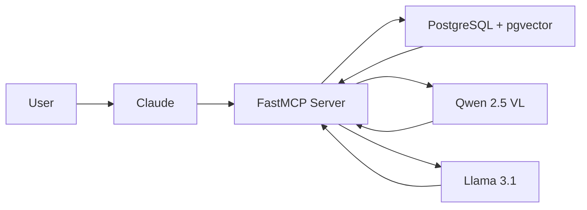
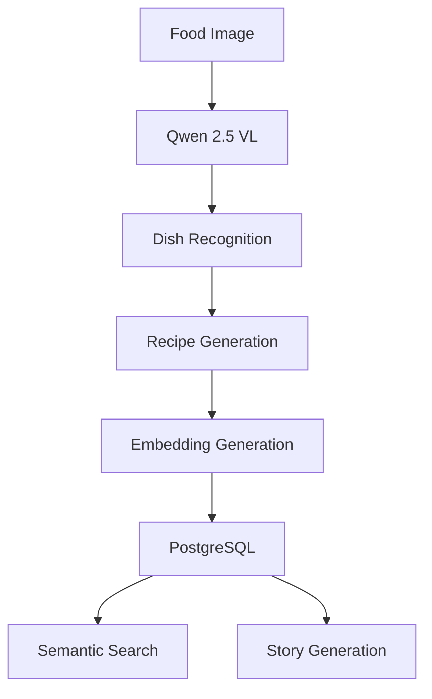
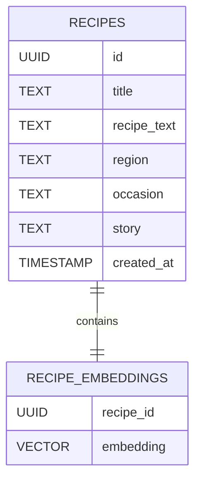

# 🍲 Family Recipe Heirloom Vault

<div align="center">


### Preserving Family Recipes Through AI, Semantic Search, Food Recognition & Cultural Storytelling

[Features](#-features) •
[Architecture](#-architecture) •
[Tech Stack](#-tech-stack) •
[Installation](#-installation) •
[Deployment](#-deployment)

</div>

---

## ✨ Overview

Across generations, recipes are lost.

They exist on:

- 📝 Torn notebooks
- 📷 Fading photographs
- 💬 Family WhatsApp messages
- 🧓 Grandparents' memories

Most recipe applications focus on **cooking**.

**Family Recipe Heirloom Vault** focuses on **preservation**.

This project is an AI-powered MCP server that transforms recipes, food photographs, and culinary traditions into a searchable cultural archive.

Built using FastMCP, PostgreSQL, pgvector, OpenRouter Vision Models, and Hugging Face LLMs.

---

# 🎯 The Problem

Family recipes are often:

- Undocumented
- Stored in physical notebooks
- Written in regional languages
- Passed orally through generations

When a family member passes away, valuable culinary knowledge can disappear forever.

This project aims to preserve:

✅ Recipes

✅ Culinary traditions

✅ Cultural context

✅ Family stories

✅ Regional food heritage

---

# 🚀 Features

## 📖 Recipe Management

Store and manage recipes inside a centralized vault.

Features:

- Add recipes
- Retrieve recipes
- List recipes
- Store region metadata
- Store occasion metadata
- Store AI-generated stories

---

## 🔍 Semantic Search

Find recipes using natural language.

Examples:

```text
Sweet Indian dessert made with milk

Festival dish prepared during Diwali

South Indian breakfast recipe

Rice based dessert
```

Powered by:

- HuggingFace Embeddings
- pgvector
- Cosine Similarity Search

---

## 🍛 Food Image Recognition

Upload a food image.

The system can:

- Identify dishes
- Estimate ingredients
- Generate recipes
- Detect cuisine
- Classify meal type
- Estimate difficulty
- Generate metadata

Powered by:

```text
Qwen 2.5 VL 72B
```

---

## 🧠 Save Recipes From Images

Convert a food photograph into a stored recipe.

Workflow:

```text
Food Image
    ↓
Dish Identification
    ↓
Recipe Generation
    ↓
Embedding Creation
    ↓
PostgreSQL Storage
```

---

## 📚 AI Story Generation

Generate rich culinary narratives.

Examples:

```text
Tell me the story behind Kheer.

How did Gulab Jamun become popular?

What is the cultural significance of Dosa?
```

Generated stories include:

- Historical context
- Regional significance
- Traditional occasions
- Cultural storytelling

Powered by:

```text
Llama 3.1 8B Instruct
```

---

# 🏗 Architecture



---

# ⚙ AI Workflow



---

# 🗄 Database Design



---

# 🛠 MCP Tools

| Tool | Description |
|--------|-------------|
| add_recipe | Add recipe to vault |
| get_recipe | Retrieve recipe by ID |
| list_recipes | List stored recipes |
| search_recipes | Keyword search |
| semantic_search_recipes | Vector similarity search |
| analyze_food_image | Food recognition and recipe generation |
| save_analyzed_recipe | Analyze and save recipe from image |
| generate_recipe_story | Generate AI culinary story |

---

# 💻 Tech Stack

## Backend

- Python 3.12+
- FastMCP
- AsyncIO

## Database

- PostgreSQL
- Supabase
- pgvector
- asyncpg

## AI Models

### Vision Model

```text
qwen/qwen2.5-vl-72b-instruct
```

Used For:

- Food recognition
- Ingredient estimation
- Recipe generation

---

### Embedding Model

```text
sentence-transformers/all-MiniLM-L6-v2
```

Used For:

- Semantic Search
- Vector Similarity Matching

---

### Story Generation Model

```text
meta-llama/Llama-3.1-8B-Instruct
```

Used For:

- Cultural storytelling
- Historical narratives
- Recipe stories

---

# 📦 Installation

## Clone Repository

```bash
git clone https://github.com/YOUR_USERNAME/recipe-heirloom-vault-mcp.git

cd recipe-heirloom-vault-mcp
```

---

## Create Virtual Environment

```bash
python -m venv .venv
```

---

## Activate Environment

### Windows

```bash
.venv\Scripts\activate
```

### Linux / macOS

```bash
source .venv/bin/activate
```

---

## Install Dependencies

Using UV:

```bash
uv sync
```

Or:

```bash
pip install -e .
```

---

# 🔐 Environment Variables

Create a `.env` file.

```env
DATABASE_URL=

OPENROUTER_API_KEY=

HUGGINGFACEHUB_API_TOKEN=

FOOD_ANALYSIS_MODEL=qwen/qwen2.5-vl-72b-instruct

HUGGINGFACE_EMBEDDING_MODEL=sentence-transformers/all-MiniLM-L6-v2

MCP_SERVER_NAME=Recipe_Heirloom_Vault
```

---

# 🗃 Database Setup

Enable pgvector:

```sql
CREATE EXTENSION IF NOT EXISTS vector;
```

Run your schema:

```sql
schema.sql
```

---

# ▶ Running Locally

```bash
python main.py
```

Expected Output:

```text
Starting Recipe Heirloom Vault MCP Server...
```

---

# ☁ Deployment

This project is designed for deployment on:

- FastMCP Horizon
- Docker
- Supabase PostgreSQL

Required Secrets:

```env
DATABASE_URL
OPENROUTER_API_KEY
HUGGINGFACEHUB_API_TOKEN
```

---

# 📈 Engineering Highlights

### Backend Engineering

- Raw SQL (No ORM)
- Async PostgreSQL
- Repository Pattern
- Service-Oriented MCP Tools

### AI Engineering

- Multimodal Vision Analysis
- Semantic Search
- Vector Embeddings
- Story Generation
- Retrieval-Augmented Search

### Cloud Engineering

- Supabase
- Environment-Based Configuration
- FastMCP Horizon Deployment
- Managed PostgreSQL

### Architecture

- MCP Server Design
- Modular Tool Registration
- Async Processing
- Vector Search Infrastructure

---

# 🎬 Example Workflow

## Save Recipe

```text
Add Recipe
      ↓
Store in PostgreSQL
      ↓
Generate Embedding
      ↓
Available for Semantic Search
```

---

## Analyze Food Image

```text
Upload Food Image
      ↓
Qwen 2.5 VL
      ↓
Identify Dish
      ↓
Generate Recipe
      ↓
Store Recipe
```

---

## Generate Story

```text
Recipe
      ↓
Llama 3.1
      ↓
Cultural Context
      ↓
Historical Narrative
      ↓
Stored Story
```

---

# 🎯 Why This Project Matters

Most recipe applications help people cook.

Family Recipe Heirloom Vault helps families preserve culinary heritage.

The goal is not simply storing recipes.

The goal is ensuring that:

- Traditions survive
- Stories remain accessible
- Culinary knowledge is preserved
- Family heritage is searchable across generations

---

# 🚀 Future Enhancements

- OCR for handwritten recipes
- Multi-language support
- Cookbook PDF generation
- Family recipe lineage tracking
- Regional recipe comparison
- Occasion-based recommendations
- Voice-to-recipe ingestion

---

# 👨‍💻 Author

Built with ❤️ using:

**Python • FastMCP • PostgreSQL • Supabase • pgvector • OpenRouter • Hugging Face • Vector Search • AI**

---

## ⭐ If you found this project interesting, consider giving it a star.